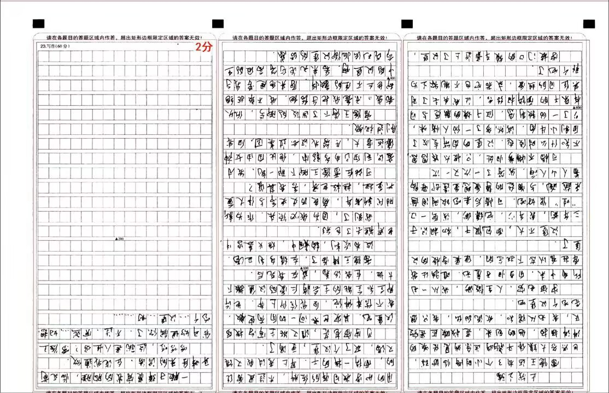

## 止战之殇

雷德王还有3个小时降临地球，世界各大媒体平台将这条消息传唤的沸沸扬扬，他的到来，是救赎还是毁灭，我无从得知，众说纷纭，我只想先吃个汉堡吧。

宇宙无穷，人生微渺，我从一无所有中来，自当归于虚无。唯独让我牵挂难以放下执念的，便是学校的汉堡了，汉堡不大，面包很干，初相识于三年前，我年少，它缥纱，浅尝一口：“哇”很好吃。可惜后来吃饭时间越来越晚，与曾经的挚爱想重逢却要隔着人山人海，我等了一次又一次。

可惜不悔梦归处，只恨太匆匆，不知什么时候起，汉堡的肉饼变成了自制小牛肉，陈然多了一份人情味，少了一份预制感，但干燥的触感与同样燥干的面饼相结合，让我失去了对其往日的热爱，或者它也不能称之为那个它了。

学校门口的餐车最近上了汉堡，用的和学校同样的佐料，不过是曾经的面饼一样的干，早上考试我又饿又渴，买了个汉堡，更渴了。

可字宙苍茫，谁又能主宰学校的汉堡呢?其实世间一切自有定数，我不信奉佛陀，自我信仰上帝，也许那全知全能的主会将仁爱的汉堡撒下大地，在我活着，或在我死后。

雷德王降临了，在维多利亚港。

没有谈判，硝烟中，炮火轰鸣中，世界想去了色彩。

我到了，因为我必须来，作为新时代新青年，肩负历史使命与伟大复兴重担，拯救世界，舍我其谁?

可站在雷德王脚下那一刻，我才意识到自己有多弱小，他比自由女神像还要大，尽管我没去过美国，但我刷过视频。

雷德王停下进攻的脚步，低头看我，示意我把手给他，我不敢拒绝却也止不住的颤抖，原来他是要我手中的汉堡啊，看来无论何等高级的生命都无法抵御汉堡的诱惑。

一颗子弹贯穿我的胸膛，临死前耳畔传来的话语，在说我通敌。

哈哈哈，这就是人性吗?雷德王，我开始理解你了，不过，突然……好想吃个汉堡····

