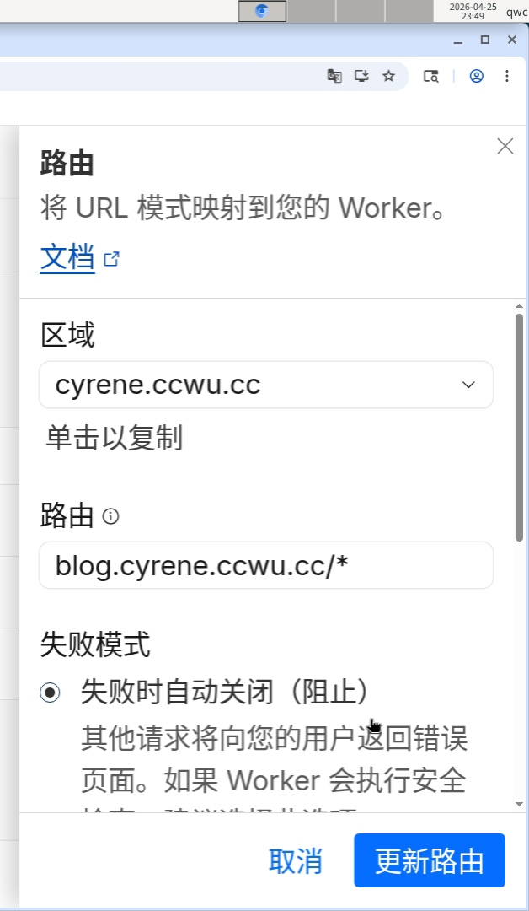
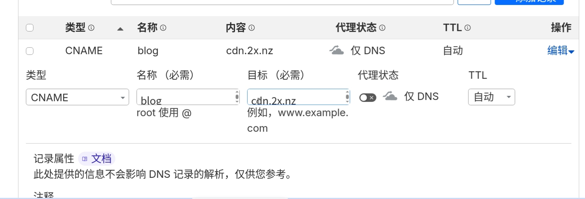

## 什么是优选

简单来说，**优选就是选择一个国内访问速度更快的Cloudflare节点。**

Cloudflare官方分配给我们的IP，在国内访问时延迟往往非常高，经常出现无法访问的情况。而通过优选，我们可以手动将域名解析到那些国内访问更快的Cloudflare IP，从而显著提升网站的访问速度和可用性。

要实现优选，我们只需要做到两点：自己控制路由规则 和 自己控制DNS解析。

## 寻找优选域名

可以从用社区大佬的[网站](https://cf.090227.xyz/)获取。

## Worker优选方法

打开你的Worker项目，选择添加路由，路由应该像**你的域名/**这样填。

最后去域名DNS，填加DNS记录，类型选CNAME，名称跟距你路由填的内容填，比如你填的blog.examp.com这里名称填blog（前提是你托管在cloudflare上的域名是examp.com），如果你路由填的域名和你托管的一样，则填@即可，最后目标填入从社区网站中复制下来的域名即可。

> [!tip]
> 优选必需有一个域名托管在cloudflare上。
> 填写路由时必需在你域名后加上/*，不然优选只能做用于你的根域名。